# Talend → Fabric Migration — Diagram Documentation

> All diagrams use [Mermaid](https://mermaid.js.org/) syntax and render natively in GitHub, Azure DevOps, and VS Code (with the Mermaid extension).

---

## Table of Contents

1. [End-to-End Pipeline Data Flow](#1-end-to-end-pipeline-data-flow)
2. [Migration Workflow — Sequence Diagram](#2-migration-workflow--sequence-diagram)
3. [Parser — Component Classification & Scoring](#3-parser--component-classification--scoring)
4. [Translator — ADF Pipeline Types & Spark Templates](#4-translator--adf-pipeline-types--spark-templates)
5. [SQL Translator — Oracle to PostgreSQL Rules](#5-sql-translator--oracle-to-postgresql-rules)
6. [Fabric Target Architecture — Medallion Pattern](#6-fabric-target-architecture--medallion-pattern)
7. [Talend → Fabric Component Mapping](#7-talend--fabric-component-mapping)
8. [Test Suite Architecture](#8-test-suite-architecture)
9. [Migration Phases — 6-Phase Timeline](#9-migration-phases--6-phase-timeline)

---

## 1. End-to-End Pipeline Data Flow

Shows the full migration pipeline from Talend XML input through parsing, translation, Fabric deployment, and post-migration validation.

---

## 2. Migration Workflow — Sequence Diagram

Step-by-step interaction between user, parser, translators, Fabric, and validators.

```mermaid
sequenceDiagram
    autonumber
    participant U as User
    participant P as Parser
    participant I as Inventory Generator
    participant ADF as ADF Translator
    participant SPK as Spark Translator
    participant SQL as SQL Translator
    participant FAB as Microsoft Fabric
    participant V as Validators

    U->>P: Export .item XML files
    P->>P: parse_all() — extract components,<br/>connections, context params, subjobs
    P->>I: parsed_jobs (List of Dict)

    I->>I: Score complexity (6 weighted factors)
    I->>I: Classify pattern (Copy/Transform/<br/>Orchestration/Custom Code...)
    I->>I: Route to DataFactory or Spark
    I-->>U: inventory.csv

    loop Each DataFactory row
        U->>ADF: translate_job(row)
        ADF->>ADF: Select pipeline type<br/>(Copy/Orchestration/DataFlow/...)
        ADF-->>U: pl_job_name.json
    end

    loop Each Spark row
        U->>SPK: translate_job(row)
        SPK->>SPK: Select template<br/>(ETL/Lookup/SCD/Incremental)
        SPK->>SPK: Convert Java expressions → PySpark
        SPK->>SPK: Generate source read code
        SPK-->>U: nb_job_name.py
    end

    opt Embedded Oracle SQL
        U->>SQL: translate(oracle_sql)
        SQL->>SQL: Apply 33 regex rules
        SQL-->>U: postgresql_sql
    end

    U->>FAB: Deploy pipelines + notebooks
    FAB->>FAB: Execute migrated jobs

    U->>V: Run post-migration validation
    V->>V: SchemaValidator — column names & types
    V->>V: RowCountValidator — source vs target counts
    V->>V: DataDiffValidator — MD5 hash comparison
    V-->>U: validation_results.json (PASS/FAIL)
```

---

## 3. Parser — Component Classification & Scoring

How `TalendJobParser` classifies XML nodes into 10 categories and how `generate_inventory()` computes a complexity score.

```mermaid
flowchart TB
    subgraph PARSE["XML Parsing"]
        XML["Talend .item XML"] --> NODE["For each <node> element"]
        NODE --> CID["Extract componentName"]
    end

    subgraph CLASSIFY["10-Category Classification"]
        CID --> INP["📥 input<br/>tOracle*Input, tPostgresql*Input,<br/>tFileInput*, tS3*Get..."]
        CID --> OUT["📤 output<br/>tOracle*Output, tPostgresql*Output,<br/>tFileOutput*, tS3*Put..."]
        CID --> XFORM["🔄 transformation<br/>tMap, tJoin, tFilterRow,<br/>tAggregateRow, tNormalize..."]
        CID --> FCTL["📋 flow_control<br/>tRunJob, tParallelize,<br/>tPreJob, tPostJob, tLoop..."]
        CID --> ERRH["⚠️ error_handling<br/>tCatch, tLogCatcher,<br/>tStatCatcher, tAssert..."]
        CID --> CUST["💻 custom_code<br/>tJava, tJavaRow, tJavaFlex,<br/>tGroovy, tPythonRow..."]
        CID --> DBOP["🗄️ db_operation<br/>tOracleConnection, tDBCommit,<br/>tCreateTable, tDBSP..."]
        CID --> FUTIL["📁 file_utility<br/>tFileExist, tFileDelete,<br/>tFileCopy, tFTPGet..."]
        CID --> UTIL["🔧 utility<br/>tLogRow, tSendMail,<br/>tSystem, tSleep..."]
        CID --> UNK["❓ unknown<br/>Unrecognized components<br/>flagged for manual review"]
    end

    subgraph SCORE["Complexity Scoring"]
        direction TB
        S1["component_count × 20%"]
        S2["transformation_complexity × 25%"]
        S3["custom_code × 20%"]
        S4["dependencies × 15%"]
        S5["data_volume × 10%"]
        S6["error_handling × 10%"]
        S1 & S2 & S3 & S4 & S5 & S6 --> TOTAL["Weighted Total Score"]
    end

    subgraph ROUTE["Target Routing"]
        TOTAL -->|"score ≤ 2.0 + Copy"| SIMPLE["🟢 Simple Copy<br/>→ DataFactory"]
        TOTAL -->|"score ≤ 3.0"| MEDIUM["🟡 Standard<br/>→ DataFactory"]
        TOTAL -->|"score > 3.0"| COMPLEX["🔴 Complex<br/>→ Spark"]
        FCTL -->|"pattern=Orchestration"| DFFORCE["→ DataFactory (forced)"]
        CUST -->|"has custom code"| SKFORCE["→ Spark (forced)"]
    end

    INP & OUT & XFORM & FCTL & ERRH & CUST & DBOP & FUTIL & UTIL & UNK --> SCORE

    style PARSE fill:#fff8e1,stroke:#f9a825
    style CLASSIFY fill:#e3f2fd,stroke:#1565c0
    style SCORE fill:#f3e5f5,stroke:#7b1fa2
    style ROUTE fill:#e8f5e9,stroke:#2e7d32
```

---

## 4. Translator — ADF Pipeline Types & Spark Templates

Decision tree showing how each inventory row is routed to one of 7 ADF pipeline types or 4 Spark notebook templates.

```mermaid
flowchart TB
    INV["Inventory Row"] --> DEC{target_fabric?}

    DEC -->|DataFactory| ADF_DEC{"Migration pattern?"}
    DEC -->|Spark| SPK_DEC{"Migration pattern?"}

    subgraph ADF["ADF Pipeline Types"]
        ADF_DEC -->|"copy / simple ETL"| COPY["📋 Copy Pipeline<br/>CopyActivity + source/sink"]
        ADF_DEC -->|"orchestration"| ORCH["🔗 Orchestration Pipeline<br/>ExecutePipeline + ForEach"]
        ADF_DEC -->|"transformation"| DFLOW["🔄 DataFlow Pipeline<br/>MappingDataFlow activity"]
        ADF_DEC -->|"file_transfer"| FTRANS["📁 File Transfer Pipeline<br/>Copy with BlobSource/Sink"]
        ADF_DEC -->|"file_management"| FMGMT["🗂️ File Management Pipeline<br/>Delete + GetMetadata"]
        ADF_DEC -->|"ddl_operations"| DDL["🏗️ DDL Pipeline<br/>Script activity + SQL"]
        ADF_DEC -->|"api_integration"| APIP["🌐 API Pipeline<br/>WebActivity + REST calls"]
    end

    subgraph SPARK["Spark Notebook Templates"]
        SPK_DEC -->|"standard ETL"| ETL["📓 etl_notebook<br/>read → transform → write"]
        SPK_DEC -->|"lookup / enrichment"| LOOK["🔍 lookup_pattern<br/>broadcast join + cache"]
        SPK_DEC -->|"slowly changing dim"| SCD["📊 scd_type2<br/>merge + effective dates"]
        SPK_DEC -->|"incremental load"| INCR["⏩ incremental_load<br/>watermark + delta merge"]
    end

    subgraph COMMON["Shared Processing"]
        JAVA["Java → PySpark<br/>50 expression rules"]
        SRC["Source Code Generator<br/>14+ source types"]
        SQLT["Oracle → PostgreSQL<br/>SQL Translator"]
    end

    ETL & LOOK & SCD & INCR --> JAVA
    ETL & LOOK & SCD & INCR --> SRC
    COPY & DFLOW & DDL --> SQLT

    style ADF fill:#e8eaf6,stroke:#283593
    style SPARK fill:#e0f2f1,stroke:#004d40
    style COMMON fill:#fff3e0,stroke:#e65100
```

---

## 5. SQL Translator — Oracle to PostgreSQL Rules

The 33 regex-based translation rules organized by category.

```mermaid
graph LR
    subgraph ORACLE["Oracle SQL Input"]
        O1["NVL(a, b)"]
        O2["SYSDATE"]
        O3["TO_DATE(s, fmt)"]
        O4["TO_CHAR(d, fmt)"]
        O5["DECODE(x, ...)"]
        O6["NVL2(a, b, c)"]
        O7["ROWNUM <= N"]
        O8["(+) outer join"]
        O9["SUBSTR(s,p,l)"]
        O10["INSTR(s1,s2)"]
        O11["LISTAGG(col,sep)"]
    end

    subgraph RULES["33 Regex Translation Rules"]
        direction TB
        R1["1️⃣ Function Mapping<br/>NVL→COALESCE, SYSDATE→CURRENT_TIMESTAMP"]
        R2["2️⃣ Date Functions<br/>TO_DATE→TO_DATE, TO_CHAR→TO_CHAR"]
        R3["3️⃣ String Functions<br/>SUBSTR→SUBSTRING, INSTR→POSITION"]
        R4["4️⃣ Aggregation<br/>LISTAGG→STRING_AGG"]
        R5["5️⃣ Decode→CASE WHEN"]
        R6["6️⃣ Join Syntax<br/>(+) → remove, rewrite as ANSI JOIN"]
        R7["7️⃣ ROWNUM → LIMIT / ROW_NUMBER()"]
        R8["8️⃣ Data Types<br/>NUMBER→NUMERIC, VARCHAR2→VARCHAR"]
        R9["9️⃣ Sequences<br/>seq.NEXTVAL→nextval(), seq.CURRVAL→currval()"]
    end

    subgraph PG["PostgreSQL Output"]
        P1["COALESCE(a, b)"]
        P2["CURRENT_TIMESTAMP"]
        P3["TO_DATE(s, fmt)"]
        P4["TO_CHAR(d, fmt)"]
        P5["CASE WHEN x=v THEN ..."]
        P6["CASE WHEN a IS NOT NULL<br/>THEN b ELSE c END"]
        P7["LIMIT N"]
        P8["Rewritten as ANSI JOIN"]
        P9["SUBSTRING(s FROM p FOR l)"]
        P10["POSITION(s2 IN s1)"]
        P11["STRING_AGG(col, sep)"]
    end

    O1 --> R1 --> P1
    O2 --> R1 --> P2
    O3 --> R2 --> P3
    O4 --> R2 --> P4
    O5 --> R5 --> P5
    O6 --> R1 --> P6
    O7 --> R7 --> P7
    O8 --> R6 --> P8
    O9 --> R3 --> P9
    O10 --> R3 --> P10
    O11 --> R4 --> P11

    style ORACLE fill:#fff3e0,stroke:#ff9800
    style RULES fill:#e3f2fd,stroke:#1976d2
    style PG fill:#e8f5e9,stroke:#388e3c
```

---

## 6. Fabric Target Architecture — Medallion Pattern

How migrated data flows through the Lakehouse medallion layers with multi-environment deployment.

```mermaid
flowchart LR
    subgraph SOURCES["Data Sources"]
        PG["PostgreSQL"]
        FILES["CSV / Excel / XML"]
        API["REST APIs"]
        BLOB["Azure Blob / ADLS"]
    end

    subgraph INGESTION["Ingestion Layer"]
        DF["Data Factory<br/>Copy Pipelines"]
        SPK["Spark Notebooks<br/>Custom Ingestion"]
    end

    subgraph LAKEHOUSE["Fabric Lakehouse"]
        subgraph BRONZE["🥉 Bronze"]
            B1["Raw tables<br/>Exact source replica"]
            B2["Append-only ingestion"]
            B3["Metadata columns<br/>(_load_ts, _source)"]
        end
        subgraph SILVER["🥈 Silver"]
            S1["Cleansed tables<br/>Data type enforcement"]
            S2["Deduplication"]
            S3["Business rules applied"]
        end
        subgraph GOLD["🥇 Gold"]
            G1["Aggregated tables"]
            G2["Star schema dims/facts"]
            G3["KPI / reporting views"]
        end
    end

    subgraph SERVE["Serving Layer"]
        WH["Fabric Warehouse<br/>SQL Analytics Endpoint"]
        PBI["Power BI<br/>Reports & Dashboards"]
    end

    subgraph ENV["Environments"]
        DEV["🟢 DEV<br/>Development workspace"]
        UAT["🟡 UAT<br/>User acceptance testing"]
        PROD["🔴 PROD<br/>Production workspace"]
        DEV --> UAT --> PROD
    end

    PG & FILES & API & BLOB --> DF & SPK
    DF & SPK --> BRONZE
    BRONZE --> SILVER
    SILVER --> GOLD
    GOLD --> WH --> PBI

    style SOURCES fill:#fff3e0,stroke:#e65100
    style INGESTION fill:#e3f2fd,stroke:#1565c0
    style LAKEHOUSE fill:#f9fbe7,stroke:#827717
    style BRONZE fill:#fff8e1,stroke:#ff8f00
    style SILVER fill:#eceff1,stroke:#546e7a
    style GOLD fill:#fff9c4,stroke:#f9a825
    style SERVE fill:#e8f5e9,stroke:#2e7d32
    style ENV fill:#fce4ec,stroke:#c62828
```

---

## 7. Talend → Fabric Component Mapping

Visual mapping of the most common Talend components to their Microsoft Fabric equivalents.

```mermaid
graph TB
    subgraph TALEND["Talend Components — 140+"]
        direction LR
        subgraph DB["Databases"]
            tOI["tOracleInput"]
            tOO["tOracleOutput"]
            tPI["tPostgresqlInput"]
            tPO["tPostgresqlOutput"]
            tMI["tMSSqlInput"]
            tMyI["tMysqlInput"]
        end
        subgraph FILE["Files"]
            tFI["tFileInputDelimited"]
            tFO["tFileOutputDelimited"]
            tFIE["tFileInputExcel"]
            tFIX["tFileInputXML"]
        end
        subgraph FLOW["Processing"]
            tMap["tMap"]
            tJoin["tJoin"]
            tFilter["tFilterRow"]
            tAgg["tAggregateRow"]
            tSort["tSortRow"]
            tUniq["tUniqRow"]
            tNorm["tNormalize"]
        end
        subgraph ORCH["Orchestration"]
            tRJ["tRunJob"]
            tPJ["tParallelize"]
            tWait["tWaitForFile"]
            tCron["tCron"]
        end
    end

    subgraph FABRIC["Microsoft Fabric Equivalents"]
        direction LR
        subgraph ADF["Data Factory"]
            CP["Copy Activity"]
            DFLO["Dataflow Gen2"]
            LU["Lookup Activity"]
            EP["Execute Pipeline"]
            WU["Wait / Until"]
            TR["Trigger / Schedule"]
        end
        subgraph SPARK["Spark Notebooks"]
            RD["spark.read (JDBC/CSV/JSON/XML)"]
            WR["df.write (Delta/Parquet)"]
            TF["df.filter / .join / .groupBy"]
            DD["df.dropDuplicates"]
            WN["df.withColumn + UDF"]
            CU["Custom PySpark code"]
        end
        subgraph LH["Lakehouse"]
            BZ["Bronze — raw ingestion"]
            SV["Silver — cleansed"]
            GD["Gold — aggregated"]
        end
    end

    tOI & tPI & tMI & tMyI --> CP
    tOI & tPI --> RD
    tOO & tPO --> WR
    tFI & tFIE & tFIX --> CP
    tFI --> RD
    tFO --> WR
    tMap & tJoin --> DFLO
    tMap & tJoin --> TF
    tFilter --> DFLO
    tFilter --> TF
    tAgg --> DFLO
    tAgg --> TF
    tSort --> TF
    tUniq --> DD
    tNorm --> WN
    tRJ --> EP
    tPJ --> EP
    tWait --> WU
    tCron --> TR

    CP --> BZ
    RD --> BZ
    DFLO --> SV
    TF --> SV
    WR --> GD

    style TALEND fill:#fff3e0,stroke:#e65100
    style FABRIC fill:#e3f2fd,stroke:#0d47a1
    style DB fill:#fce4ec,stroke:#c62828
    style FILE fill:#f3e5f5,stroke:#6a1b9a
    style FLOW fill:#e8f5e9,stroke:#1b5e20
    style ORCH fill:#fff8e1,stroke:#f57f17
    style ADF fill:#e8eaf6,stroke:#283593
    style SPARK fill:#e0f2f1,stroke:#004d40
    style LH fill:#f1f8e9,stroke:#33691e
```

---

## 8. Test Suite Architecture

Overview of the 197-test suite: 7 test files, 6 XML fixtures, and coverage across all modules.

```mermaid
graph TB
    subgraph SUITE["Test Suite — 197 Tests"]
        direction TB

        subgraph TP["test_parser.py — 57 tests"]
            TP1["XML parsing & component extraction"]
            TP2["10-category classification"]
            TP3["Connection & context params"]
            TP4["Comment node handling"]
            TP5["Metadata & inventory generation"]
        end

        subgraph TA["test_translate_to_adf.py — 34 tests"]
            TA1["7 pipeline types generation"]
            TA2["Activity structure validation"]
            TA3["Linked service references"]
            TA4["Parametrized structure checks"]
        end

        subgraph TS["test_translate_to_spark.py — 43 tests"]
            TS1["4 notebook templates"]
            TS2["Java→PySpark expression rules"]
            TS3["15 source type code gen"]
            TS4["Custom code preservation"]
        end

        subgraph TQ["test_sql_translator.py — 26 tests"]
            TQ1["33 Oracle→PostgreSQL rules"]
            TQ2["DECODE → CASE WHEN"]
            TQ3["ROWNUM → LIMIT / ROW_NUMBER()"]
            TQ4["Data types & sequences"]
            TQ5["Complex nested expressions"]
        end

        subgraph TV["test_validation.py — 20 tests"]
            TV1["Schema comparison"]
            TV2["Row count ± tolerance"]
            TV3["MD5 hash data diff"]
            TV4["Zero-count edge cases"]
            TV5["Result persistence"]
        end

        subgraph TR["test_regression.py — 17 tests"]
            TR1["End-to-end pipeline checks"]
            TR2["Output determinism check"]
            TR3["Cross-module consistency"]
            TR4["SQL translation regression"]
        end
    end

    subgraph FIX["fixtures/ — 6 Talend .item files"]
        F1["simple_copy_job.item"]
        F2["transform_job.item"]
        F3["orchestration_job.item"]
        F4["custom_code_job.item"]
        F5["complex_etl_job.item"]
        F6["file_transfer_job.item"]
    end

    FIX --> TP
    FIX --> TA
    FIX --> TS
    FIX --> TQ
    FIX --> TV
    FIX --> TR

    style SUITE fill:#f3e5f5,stroke:#7b1fa2
    style FIX fill:#e0f7fa,stroke:#00838f
    style TP fill:#fff8e1,stroke:#f9a825
    style TA fill:#e8f5e9,stroke:#2e7d32
    style TS fill:#e3f2fd,stroke:#1565c0
    style TQ fill:#fce4ec,stroke:#c62828
    style TV fill:#fff3e0,stroke:#ef6c00
    style TR fill:#f1f8e9,stroke:#558b2f
```

---

## 9. Migration Phases — 6-Phase Timeline

Gantt chart of the recommended delivery plan with phase dependencies.

```mermaid
gantt
    title Migration Phases — 6-Phase Delivery Plan
    dateFormat  YYYY-MM-DD
    axisFormat  %b %d

    section Phase 1 - Discovery
    Export Talend projects          :p1a, 2025-01-06, 5d
    Parse XML + inventory           :p1b, after p1a, 5d
    Complexity scoring              :p1c, after p1b, 3d

    section Phase 2 - Translation
    ADF pipeline generation         :p2a, after p1c, 10d
    Spark notebook generation       :p2b, after p1c, 10d
    SQL translation Oracle→PG       :p2c, after p1c, 7d

    section Phase 3 - Deployment
    DEV environment setup           :p3a, after p2a, 5d
    Deploy pipelines + notebooks    :p3b, after p3a, 5d
    Configure linked services       :p3c, after p3a, 3d

    section Phase 4 - Validation
    Schema validation               :p4a, after p3b, 3d
    Row count validation            :p4b, after p4a, 3d
    Data diff (MD5)                 :p4c, after p4b, 5d
    Fix discrepancies               :p4d, after p4c, 5d

    section Phase 5 - UAT
    UAT environment promotion       :p5a, after p4d, 3d
    Business validation             :p5b, after p5a, 10d
    Performance testing             :p5c, after p5a, 7d

    section Phase 6 - Production
    PROD deployment                 :crit, p6a, after p5b, 3d
    Parallel run monitoring         :p6b, after p6a, 10d
    Talend decommission             :p6c, after p6b, 5d
```

---

## Rendering Notes

| Platform | Support |
|----------|---------|
| **GitHub** | Native Mermaid rendering in `.md` files |
| **Azure DevOps** | Native Mermaid in wiki and PR descriptions |
| **VS Code** | Install [Markdown Preview Mermaid Support](https://marketplace.visualstudio.com/items?itemName=bierner.markdown-mermaid) |
| **Confluence** | Use the Mermaid plugin or export as PNG/SVG |
| **Export to PNG** | Use `mmdc` CLI: `npx @mermaid-js/mermaid-cli -i diagrams.md -o output/` |
